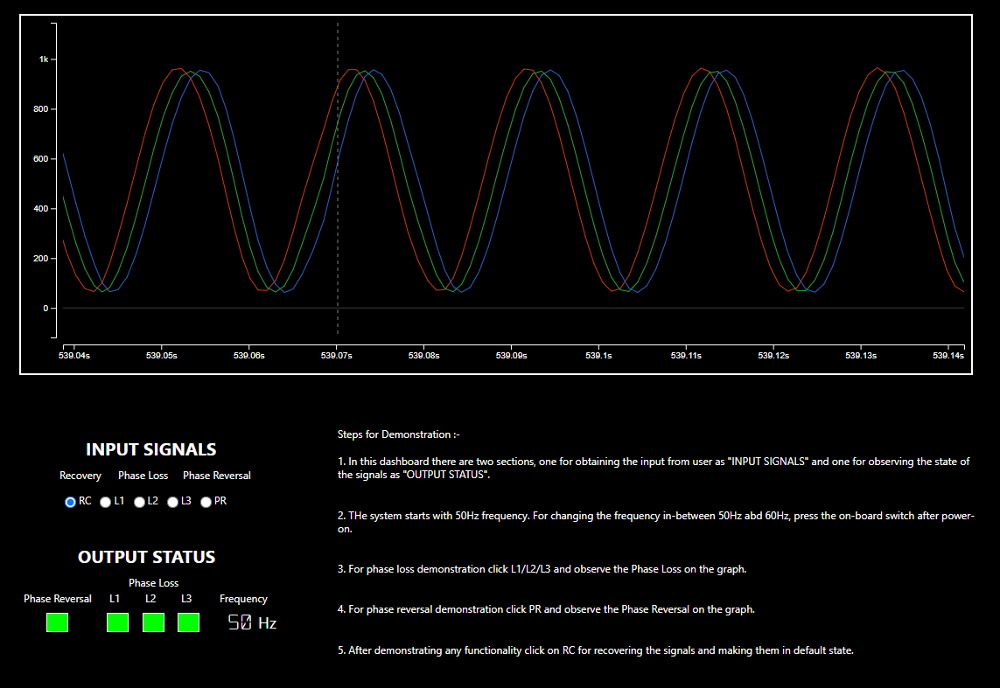

<!-- Please do not change this html logo with link -->

# Phase Sequence Detection of Three-Phase AC Supply Using PIC18F56Q24 Microcontroller

The PIC18-Q24 microcontroller family showcases a Multi-Voltage I/O (MVIO) interface with
multiple pins I/O powered by an alternative VDD pin and offers Enhanced Code Protection features to provide increased security to the firmware and data. The 10-bit Analog-to-Digital Converter with Computation (ADCC) capable of 300 ksps, built-in Zero-Cross Detector (ZCD), timer peripherals are essential to demonstrate phase sequence detection applications.

This application demonstrator is developed using MPLAB® X IDE. It showcases the phase sequence detection, phase reversal and phase loss detection on the emulated three phase AC supply using the PIC18F56Q24 microcontroller.

## Software Used

This application uses MPLAB® X IDE compiler and graphical code generator to provide an easy and hassle-free user experience.

The following tools are used for this demo application:

* [MPLAB® X IDE](https://www.microchip.com/mplab/mplab-x-ide) v6.15 or newer
* [XC8 compiler](https://www.microchip.com/mplab/compilers) v2.45 or newer
* [MPLAB® Code Configurator(MCC)](https://www.microchip.com/mplab/mplab-code-configurator) v5.3.7 or newer
* [Microchip PIC18F-Q Series Device Support](https://packs.download.microchip.com) 1.23.425 or newer
* [Data Visualizer](https://www.microchip.com/en-us/tools-resources/debug/mplab-data-visualizer) v1.3.1331 or newer
* ADC MCC Melody Driver 1.0.6
* SPI MCC Melody Driver 5.0.0
* TMR2 MCC Melody Driver 4.0.18
* UART MCC Melody Driver 7.1.1
* ZCD MCC Melody Driver 4.0.10

## Hardware Used

* [PIC18F56Q24 Curiosity Nano board](https://www.microchip.com/en-us/development-tool/EV01E86A")
* [Curiosity Nano base for Click boards](https://www.microchip.com/developmenttools/ProductDetails/AC164162)
* [Waveform Clicks](https://www.mikroe.com/waveform-click)
* SMA male cable 

## Demonstration Setup

The following steps explain how to set the hardware for the Three-Phase sequence detection, using the PIC18F56Q24 microcontroller. The figure below shows the hardware setup used for the application demo. 
* Insert the PIC18F56Q24 Curiosity Nano board in the slot designed for MCU board.

**Note:** When inserting the Curiosity Nano board, the user can use the Curiosity Nano Base markings for better orientation.

* Insert the three Waveform Clicks in the three mikroBUSTM slots available on the Curiosity Nano Base board
* Connect the output of the Waveform Clicks to the respective microcontroller I/O pins using SMA connectors
* Connect the SMA output connectors to inputs of ADC and ZCD as given below (It has only two ZCDs which are connected to Click 1 and Click 3)
	* Connect Signal-1 (waveform color - Red) of Waveform Click 1 to the RA0 (ADC AN0 input) and RC2 (ZCD2 Input)
	* Connect Signal-2 (waveform color - Green) of Waveform Click 2 to the RA1 (ADC AN1 input)
	* Connect Signal-3 (waveform color - Blue) of Waveform Click 3 to the RA2 (ADC AN2 input) and RB0 (ZCD1 Input)
* Connect the Curiosity Nano Board to a host computer (PC) using the standard USB type-C cable

  
   Figure 1: Demo Hardware Setup 

## Data Visualizer Configuration

The MPLAB Data Visualizer is a program used to process and visualize data from a running embedded target. The program may be accessed from within MPLAB X IDE or as a standalone program. The Data Visualizer tool is used as a graphical user interface while demonstrating the application by displaying the emulated three phase supply waveforms, output status and for receiving the user inputs. 

The pre-configured data streamer and custom dashboard files are available with the firmware package. The steps given below are used for configuring the Data Visualizer, while using the data streamer file and custom dashboard file to get the setup ready.          

Here is the list of Data Visualizer modules used for demonstration:
* Serial Port (Baud Rate – 230400)
* Custom Dashboard
* Data Streamer 

Refer the Data Visualizer User Guide for more information about [Data Visualizer](https://ww1.microchip.com/downloads/en/DeviceDoc/MPLAB_Data_Visualizer_50003001A.pdf). 

The demo uses an emulated three-phase AC supply to showcase the essential features of the application. To emulate the AC power supply three Waveform Clicks are used in the application.

## Custom Dashboard: User Inputs and Output Indicators  

The Data Visualizer custom dashboard is customized for this application, user input and output elements are listed below:     

### User inputs

All the above mentioned inputs are provided using the radio channel feature
-	Recover three-phase supply from faults (RC)
-	Insert phase loss fault on L1 phase (L1)
-	Insert phase loss fault on L2 phase (L2)
-	Insert phase loss fault on L3 phase (L3)
-	Insert phase reversal fault (PR)

### Application Output Indicators

-	Three phase Waveforms (using Graphs)
-	Phase reversal (using status indicator)
-	Phase loss status (using status indicator)
-	Operating Freq (using sequence output)
The figure below shows the Data Visualizer custom dashboard and input, output elements.

  
   Figure 2: User Inputs & Output Status  

## Demo Operation

1.	Configure the serial port for communication with the Curiosity Nano board. 
2.	Configure the data streamer for interfacing dashboard window with the serial port by clicking on <b>IMPORT</b> tab. The data streamer configuration **(data-streamer-config.txt)** file is available in the example firmware folder.
3.	Configure the graph window for displaying the emulated three phase supply AC waveforms, generated by the Waveform Clicks.
4.	Configure the custom dashboard window to display the output and to receive user inputs by clicking on load option on dashboard window. The custom dashboard **(custom-dashboard-config)** design file is available in the example firmware folder. 
5.	There are elements on the custom dashboard as inputs and status showing the phase states as outputs.
6.	Connect the hardware and prepare the demo setup as per the instructions provided in the Demonstration setup section.
7.	Click Serial Port Connect button.
8.	Using push button (SW0) on the Curiosity Nano board, select the appropriate frequency for the three-phase signal. The selected frequency is displayed on the custom dashboard window.
9.	Zoom in or zoom out the graph on custom dashboard by clicking the +/- magnifier symbol on the left side of the graph window.
10.	Insert phase loss fault by clicking the L1 radio button on dashboard, which disables the L1 signal out of three-phase signal to emulate phase loss input. 
11.	Insert phase loss fault by clicking the L2 radio button on dashboard, which disables the L2 signal out of three-phase signal to emulate phase loss input.
12.	Insert phase loss fault by clicking the L3 radio button on dashboard, which disables the L3 signal out of three-phase signal to emulate phase loss input.
13.	Insert phase reversal by clicking the PR radio button on dashboard, which changes the sequence of the three-phase signal.
14. The status indicators have two states:
	Red - phase reversal, phase loss
	Green - No phase reversal, No phase loss

The Figure below shows the Data Visualizer Dashboard for Phase Sequence Detection for the Three-phase AC Supply.

  
   Figure 3: Data Visualizer Custom Dashboard 

