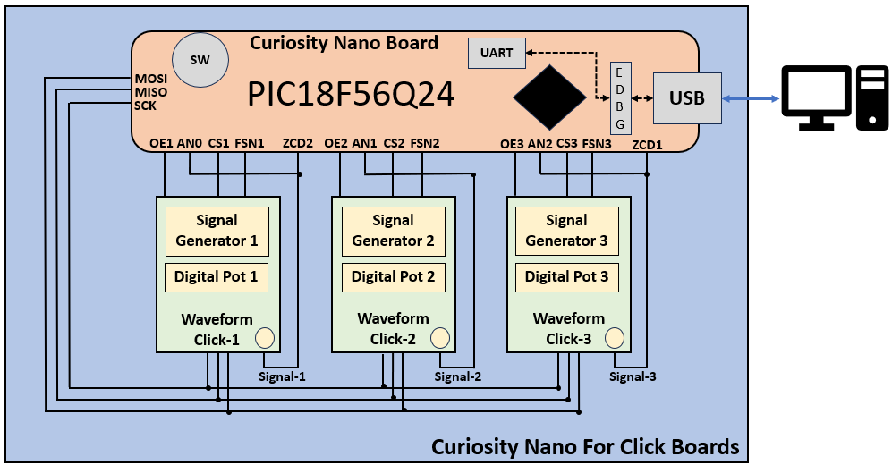

<!-- Please do not change this logo with link -->

# Phase Sequence Detection of Three-Phase AC Supply using PIC18F56Q24 microcontroller

The AVR® DA family of microcontrollers are peripheral rich, high performance and low-power 8-bit microcontroller devices. The built-in Zero-Cross Detector (ZCD), high resolution Analog-to-Digital Converter (ADC), timer peripherals are essential for realizing phase sequence detection applications.

This application demonstrator developed using MPLAB® X IDE. It showcases the phase sequence detection and phase loss detection on emulated three phase AC supply using PIC18F56Q24 microcontroller.

## Software Used

This application uses MPLAB® X IDE compiler and graphical code generator to provide an easy and hassle-free user experience.

The following tools are used for this demo application:

* [MPLAB® X IDE](https://www.microchip.com/mplab/mplab-x-ide) v6.15 or newer
* [XC8 compiler](https://www.microchip.com/mplab/compilers) v2.45 or newer
* [MPLAB® Code Configurator(MCC)](https://www.microchip.com/mplab/mplab-code-configurator) v5.3.7 or newer
* Microchip PIC18F-Q Series Device Support 1.23.425 or newer device pack](https://packs.download.microchip.com)
* [Data Visualizer](https://www.microchip.com/en-us/tools-resources/debug/mplab-data-visualizer) v1.3.1331 or newer
* ADC MCC Melody Driver 1.0.6
* SPI MCC Melody Driver 5.0.0
* TMR2 MCC Melody Driver 4.0.18
* UART MCC Melody Driver 7.1.1
* ZCD MCC Melody Driver 4.0.10

## Hardware Used

* [PIC18F56Q24 Curiosity Nano board](https://www.microchip.com/en-us/development-tool/EV01E86A")
* [Curiosity Nano base for click boards](https://www.microchip.com/developmenttools/ProductDetails/AC164162)
* [Waveform clicks](https://www.mikroe.com/waveform-click)
* SMA male cable 

## Demonstration Setup

The following steps explain how to set the hardware for the Three-Phase sequence detection, using the PIC18F56Q24 microcontroller. The figure below shows the hardware setup used for the application demo. 
* Insert the PIC18F56Q24 Curiosity Nano board in the slot designed for MCU board.

  **Note:** When inserting the Curiosity Nano board, the user can use the Curiosity Nano Base markings for a better orientation.

* Insert three waveform clicks in the three mikroBUS slots available on the Curiosity Nano Base board.
* Connect the output of the waveform clicks to the respective microcontroller I/O pins using SMA connectors. 
* Connect the SMA output connectors to input of ADC and ZCD. (It has only 2 ZCDs which are connected to click 1 and click 3)
* Connect the Curiosity Nano Board to a host computer (PC) using the standard USB type-C cable.

  
   Figure 1: Demo Hardware Setup 

## Data Visualizer Configuration
The Data Visualizer tool is used as a graphical user interface while demonstrating the application by displaying the emulated three phase supply waveforms, output status and for receiving the user inputs.
Pre-configured data streamer file and custom dashboard file is available with the firmware package. The steps below are for configuring the Data Visualizer, while using the data streamer file and custom dashboard file to get the setup ready.          

Here is the list of Data Visualizer modules used for demonstration:
* Serial Port (Baud Rate – 230400)
* Custom Dashboard (Custom Dashboard file is given for the demonstration) 
* Data Streamer (Data Streamer file is given for the demonstration)  

Refer the Data Visualizer User Guide for more information about [Data Visualizer](https://ww1.microchip.com/downloads/en/DeviceDoc/MPLAB_Data_Visualizer_50003001A.pdf). 

The demo uses an emulated three-phase AC supply to showcase the essential features of the application. To emulate the AC power supply three waveform clicks are used in the application.

## Custom Dashboard: User Inputs and Output Indicators  

The Data Visualizer custom dashboard is customized for this application, user input and output elements are listed below:     

### User inputs

-	Recover three-phase supply from faults
-	Insert phase loss fault on L1 phase
-	Insert phase loss fault on L2 phase
-	Insert phase loss fault on L3 phase
-	Insert phase reversal (PR) fault

### Application Output Indicators

-	Three phase Waveforms
-	Phase reversal status indicator
-	Phase loss status indicator
-	Operating Freq (Hz)

The figure below shows the Data Visualizer custom dashboard and input,output elements.

## Demo Operation

1.	Configure serial port for communication with the Curiosity Nano Board. 
2.	Configure data streamer for interfacing Graph window and Dashboard window with the serial port control panel. Data streamer configuration **(data-streamer-config.txt)** file is available in example firmware folder.
3.	Configure Graph window for displaying the emulated three phase supply AC waveforms, generated by the waveform clicks.
4.	Configure custom dashboard window to display the output and to receive user inputs. Custom dashboard **(custom-dashboard-config)** design file is available in example firmware folder. 
5.	There are elements on the custom dashboard as inputs and status showing the phase states as outputs.
6.	Connect the hardware and prepare demonstrator setup as per the instructions provided in Demonstration setup section.
7.	Click Serial Port Control Panel Connect button.
8.	Using push button (SW0) on the curiosity nano board, select the appropriate frequency for the three-phase signal. The selected frequency is displayed on the custom dashboard window.
9.	Zoom in or zoom out the graph on custom dashboard by clicking the +/- magnifier symbol on the left side of the graph window.
10.	Insert phase loss fault by clicking the L1 radio button on dashboard, which disables the L1 signal out of three-phase signal to emulate phase loss input. 
11.	Insert phase loss fault by clicking the L2 radio button on dashboard, which disables the L2 signal out of three-phase signal to emulate phase loss input.
12.	Insert phase loss fault by clicking the L3 radio button on dashboard, which disables the L3 signal out of three-phase signal to emulate phase loss input.
13.	Insert phase reversal by clicking the PR radio button on dashboard, which changes the sequence of the three-phase signal.

The Figure below shows the Data Visualizer Dashboard for Phase Sequence Detection for the Three-phase AC Supply.

  
   Figure 2: Data Visualizer Dashboard 

